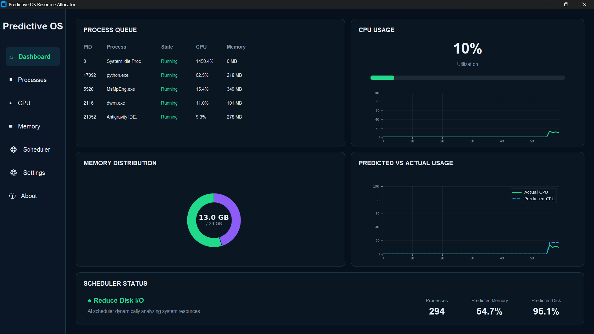

# 🎮 Predictive OS Resource Allocator

A machine learning-based Operating Systems project that monitors real-time system resources, predicts future CPU, memory, and disk utilization, and generates intelligent resource allocation decisions through an interactive desktop dashboard.

Developed as part of a university Operating Systems project, this application combines **Operating Systems concepts, Machine Learning, real-time system monitoring, and GUI development** into a practical end-to-end system.

---

## 📸 Dashboard Preview




---

## 🔍 Project Overview

The **Predictive OS Resource Allocator** explores the idea of proactive resource management.

Instead of only monitoring current system utilization, the application collects real-time system telemetry and uses machine learning models to predict future resource requirements.

The system:

* 📊 Monitors real-time CPU, memory, disk, network, and process activity
* 🧠 Predicts future CPU, memory, and disk utilization
* ⚙️ Generates intelligent resource allocation decisions
* 📋 Displays active processes and their resource consumption
* 📈 Compares predicted CPU usage with actual CPU usage
* 💾 Visualizes real-time memory distribution
* 🎛️ Displays dynamic scheduler recommendations
* 🖥️ Presents system information through a modern desktop dashboard

The project provides an interactive way to explore the integration of **Operating Systems, Machine Learning, system telemetry, and real-time data visualization**.

---

## 🛠️ Features

🧠 **Machine Learning Prediction**  
Predicts CPU, memory, and disk utilization using system telemetry and trained machine learning models.

⚙️ **Dynamic Resource Allocation**  
Analyzes predicted resource usage and generates resource-management decisions based on the current system state.

📊 **Real-Time Dashboard**  
Provides a modern graphical interface for monitoring system performance and ML predictions.

📋 **Live Process Queue**  
Displays active processes along with PID, process state, CPU utilization, and memory consumption.

💻 **CPU Monitoring**  
Tracks and visualizes real-time CPU utilization.

💾 **Memory Distribution**  
Displays system memory usage through a dynamic donut chart.

📈 **Predicted vs Actual Usage**  
Compares machine learning predictions against actual CPU utilization over time.

🎛️ **AI Scheduler Status**  
Displays dynamic resource allocation recommendations generated by the allocation engine.

🔄 **Continuous System Monitoring**  
Automatically updates system telemetry, predictions, process information, and dashboard visualizations.

---

## 💻 Technologies Used

1. **Python 3.x** — Core application development
2. **CustomTkinter** — Modern desktop GUI
3. **Matplotlib** — Real-time system data visualization
4. **psutil** — Operating system telemetry and process monitoring
5. **Scikit-learn** — Machine learning model development and prediction
6. **Pandas** — Dataset processing and manipulation
7. **NumPy** — Numerical computation

---

## ⚙️ How It Works

The application follows a simple monitoring and prediction pipeline:

```text
Real-Time System Metrics
          ↓
   Feature Collection
          ↓
 Machine Learning Model
          ↓
 Resource Predictions
          ↓
 Allocation Decision Engine
          ↓
 Real-Time GUI Dashboard
